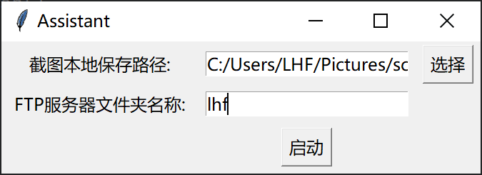
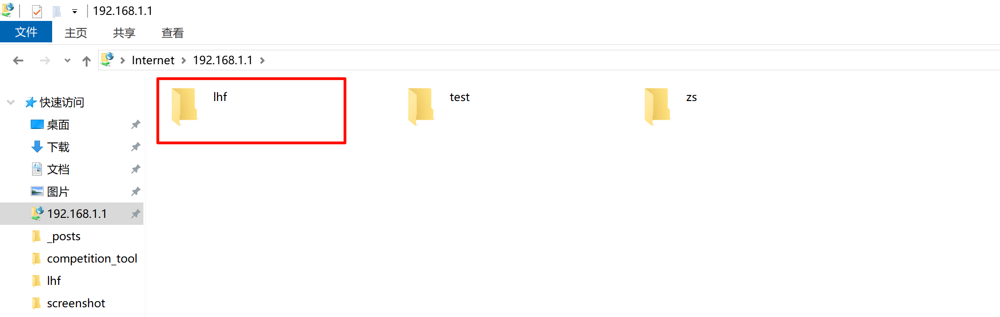

# competition_tool

# 主要功能

对整个屏幕进行截图，然后上传截取到的屏幕图片到局域网下的的FTP服务器(ftp://192.168.1.1/)，供其他用户下载使用

# 使用方法

以下两种方法都可触发截图事件:

+ **Caps Lock 长按 + 鼠标单击**：先长按Caps Lock ，然后单击一次鼠标左键完成截图。截图完成后松开Caps Lock键，需要继续截图时重复上述过程。
+ **2s内连续四次单次鼠标滚轮**：在两秒内连续四次鼠标滚轮完成截图，滚轮上下滚动不影响截图。

# 注意事项

+ 使用程序时最好`以管理员身份运行`，确保程序拥有较高权限。

+ 如果使用双屏，无法截取副屏的内容，即使把鼠标焦点移动到副屏上，满足截图条件也只会截取主屏的画面。

# 用途

可以在某些比赛中将赛题截图然后上传到FTP服务器上，请其他人帮忙搜题解题(有摄像头或屏幕受到监控的情况下)

也可以在招聘的笔试、面试中使用。

# 程序运行截图

**本地保存路径**:本地PC保存截图的路径，先将截取到的屏幕图片保存到本地PC，然后才上传到FTP服务器

**FTP服务器文件夹名称**：FTP存放截图的文件夹，如果在FTP服务器上已有个人文件夹直接填入文件夹名称即可，如果没有个人文件夹，填入名称后会自动在FTP服务器上创建下面填入的文件夹，例如lhf

